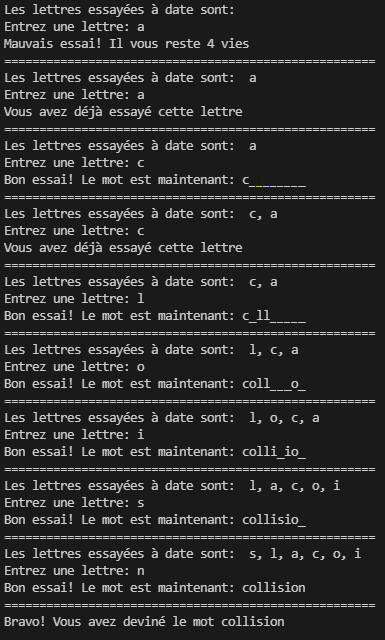
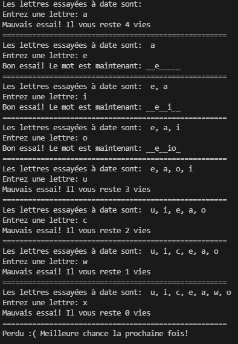

# PROJET 1

#### :alarm_clock: [Date de remise le dimanche 29 mai 2022 à 23h59]
## Objectif

Ce TP a pour objectif de vous introduire à l'algorithmie avec le langage de programmation Python. Celui-ci est composé du fichier hangman.py que vous devrez compléter. On veut que vous soyez capables d'écrire vos propres programmes, donc ce projet vous demandera d'être autonomes dans votre démarche et de bien vérifier la qualité de votre code.

Le code doit rouler en exécutant le fichier hangman.py

## Grille de correction

Une démarche de qualité et un bon résultat donnent la note maximale. Une erreur minime (ex faute de frappe) mènera à une pénalité de 0.5 points. Puisqu'il s'agit d'un cours de programmation, une attention particulière sera accordée à la qualité du code.

Un code qui ne roule pas est un 0 automatique, alors testez votre code!

## Évaluations par les pairs

Les projets auront une étape d'évaluation par les pairs, c'est-à-dire que vous devrez, après la remise, pratiquer votre sens critique et évaluer la qualité du code de deux autres projets. Vous devrez assigner une note (-1, 0 ou 1) selon ce que vous remarquerez en termes de qualité et lisibilité du code.

## Consignes à respecter

Tout d'abord, assurez-vous d'avoir lu le fichier [Instructions.md](Instructions.md) et d'avoir téléchargé les fichiers parties 1-4.py que vous devrez complété.

Aussi, vous ne pouvez pas importer d'autres librairies que celle qui sont déjà importées dans les fichiers.

## Rouler le code

Lancez le fichier hangman.py afin de tester votre script.

## Mise en situation: Un jeu de bonhomme pendu! 🎮

Le but de ce TP est de coder son propre jeu de bonhomme pendu. Un dictionnaire vous est fourni avec des mots en français de différents types (verbe, nom) et genres (féminin, masculin).

La première étape sera de générer une liste de mots possibles à faire deviner au joueur. On veut extraire du dictionnaire fourni les mots de types **noms féminins**.

La seconde étape sera de coder la boucle de jeu!
Un joueur commence avec 5 vies. Tant qu'il n'a pas trouvé le mot complet et qu'il lui reste des vies, il peut continuer à deviner des lettres.
Au début de la boucle de jeu (tour), on veut rappeller au joueur quelles lettres il a deviné jusqu'à présent.
Puis, on veut lui demander de deviner une nouvelle lettre.
Il y a 3 options possibles ici:

Si le joueur a déjà essayé cette lettre, il ne perd pas de vie, mais il doit y avoir un message qui dit qu'il a déjà essayé cette lettre.

Si le joueur devine une nouvelle lettre qui fait partie du mot à deviner, on ajoute la lettre à la liste des lettre déjà essayées et il doit y avoir un message qui lui que c'est un bon essai en plus d'afficher le mot qu'il a trouvé jusqu'à mainenant.

Si le joueur devine une nouvelle lettre qui est mauvaise, on ajoute la lettre à la liste des lettres déjà essayées, il perd une vie, et il doit y avoir un message qui dit que c'était un bon essaie en plus d'afficher le nombre de vies restantes.

Finalement, si le joueur trouve le mot ou qu'il n'a plus de vies, le jeu finit et on affiche un message de félicitations s'il a gagné, ou un message de défaite s'il a perdu.

## Fonctions utiles

Plusieurs fonctions vous seront utiles pour ce TP:

- La fonction `set(liste)` prends en paramètre une liste et enlève les doublons. C'est exactement comme la fonction enleverDoublons qu'on a codé à la main dans le TP1. [Plus de détails](https://www.programiz.com/python-programming/set)

```python
liste = ['a', 'a', 'b', 'c']
listeSansDup = set(liste) # listeSansDup = ['a', 'b', 'c']
```

- La librairie `random` contient une fonction qui vous permet de faire une sélection  alétoire dans une liste. Il faudra chercher un peu pour la trouver, voici le lien vers la [doc](https://docs.python.org/3/library/random.html).

- La fonction `join` permet de joindre les éléments d'une liste en les séparant par un charactère particulier. [Plus de détails](https://www.w3schools.com/python/ref_string_join.asp)

```python
liste = ['a','b','c']
sep = '###'
message = sep.join(liste) # message = a###b###c
```

## Exemples d'exécution




## Pour aller plus loin

Juste si ça vous intéresse :) Une fois que vous aurez complété le TP, pour vous pratiquer à développer des programmes, vous pourriez essayer de le refaire à partir d'un fichier vide (sans la structure en commentaires). Si vous aimez programmer des jeux, vous avez déjà le savoir nécessaire pour programmer des _rpg text-based console games_ simples. Sinon, vous pourriez essayer de programmer un jeu qui fait deviner à l'utilisateur un nombre en lui disant si ses essais sont plus grands ou petits que le nombre cible.
